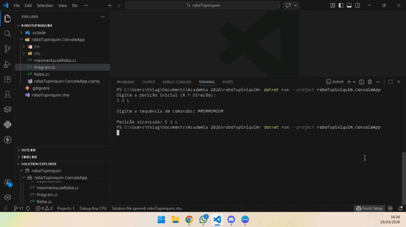

# 🤖 Robô Tupiniquim I

Aplicação console desenvolvida em **C#** que simula a movimentação de um robô em um plano cartesiano (grid), com base em comandos fornecidos pelo usuário.

---

## 📋 Descrição

O programa permite controlar um robô informando:

- Posição inicial (`X`, `Y`)
- Direção inicial (`N`, `S`, `L`, `O`)
- Sequência de comandos (`E`, `D`, `M`)

Cada comando é processado individualmente e, ao final, a posição do robô é exibida no console.

---

## 🧭 Direções

O robô pode estar orientado nas seguintes direções:

| Letra | Significado |
|------|------------|
| `N` | Norte |
| `S` | Sul |
| `L` | Leste |
| `O` | Oeste |

---

## 🎮 Comandos

| Comando | Ação |
|--------|------|
| `E` | Gira o robô 90° para a esquerda |
| `D` | Gira o robô 90° para a direita |
| `M` | Move o robô 1 posição para frente |

---

## ⚙️ Funcionamento

### 🔹 Fluxo principal (`Program.cs`)

```csharp
Robo robo = ObterPosicaoInicial();
string comandos = ObterComandos();

ExecutarComandos(robo, comandos);

ExibirPosicaoFinal(robo);

🔹 Entrada de dados

O usuário informa a posição inicial no formato:

X Y Direção

Exemplo:
1 2 N

Depois, informa a sequência de comandos:
EMEMEMEMM

🔹 Execução dos comandos

foreach (char comando in comandos)
{
    MovimentacaoRobo.ExecutarComando(robo, comando);
}

Cada comando é enviado para a classe MovimentacaoRobo, responsável pela lógica de movimentação.

🧠 Estrutura das Classes
🧍 Classe Robo

Responsável por armazenar o estado do robô:

public class Robo
{
    public int X;
    public int Y;
    public char Direcao;

    public Robo(int x, int y, char direcao)
    {
        X = x;
        Y = y;
        Direcao = direcao;
    }
}

🔄 Classe MovimentacaoRobo

Classe estática responsável por executar os comandos.

Execução de comandos:

if (comando == 'E')
    robo.Direcao = VirarEsquerda(robo.Direcao);

else if (comando == 'D')
    robo.Direcao = VirarDireita(robo.Direcao);

else if (comando == 'M')
    Mover(robo);

Movimento do robô:

switch (robo.Direcao)
{
    case 'N': robo.Y++; break;
    case 'S': robo.Y--; break;
    case 'L': robo.X++; break;
    case 'O': robo.X--; break;
}

Rotação do robô

Direita (D):
N → L → S → O → N

Esquerda (E):
N → O → S → L → N

▶️ Exemplo de Execução

Digite a posição inicial (X Y Direção):
1 2 N

Digite a sequência de comandos:
EMEMEMEMM

Posição alcançada: 1 3 N

📂 Estrutura do Projeto

roboTupiniquim/
 ├── Program.cs
 ├── MovimentacaoRobo.cs
 ├── Robo.cs

 🚀 Como Executar

 git clone https://github.com/ThiaggoSylva/roboTupiniquim.git
cd roboTupiniquim
dotnet run

🧠 Conceitos Utilizados
>Programação Orientada a Objetos (POO)
>Separação de responsabilidades
>Métodos estáticos
>Estruturas condicionais (if, switch)
>Laço de repetição (foreach)
>Entrada e saída via console

🧩 Possíveis Melhorias
 >Encapsular atributos da classe Robo (usar propriedades)
 >Validar entrada do usuário
 >Tratar comandos inválidos
 >Definir limites do grid
 >Implementar testes automatizados

 👨‍💻 Autor

Thiago Silva

